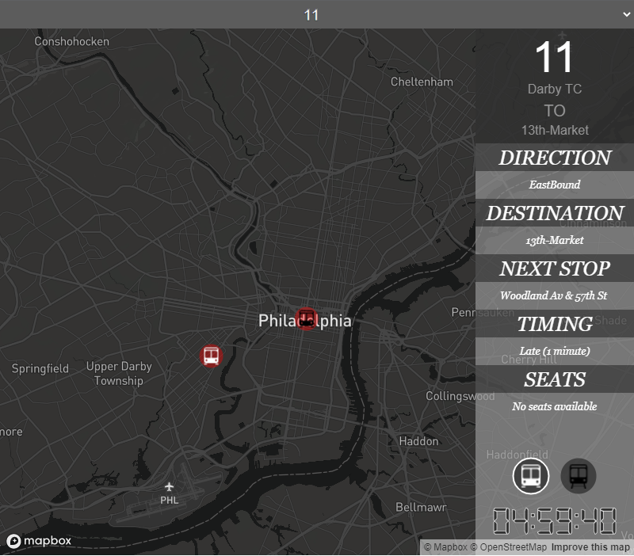

## Philadelphia public transport application in real-time

An application that visualises Philapelphia's public transportation data in real time, including on route buses, trolleys, trains and bus stops/train stations.
It's possible to select specific vehicles to access more data such as:
- destination
- next stop
- current stop
- timing
- free seats

As a basemap the application uses [Mapbox tiles](https://www.mapbox.com/).
The data that is being processed and visualised is fetched from the [SEPTA API service](http://www3.septa.org/api/) every 10 seconds.
For graphics, the application uses [p5.js](https://p5js.org/).

Application is deployed [here](https://philadelphia-live-transit.herokuapp.com/)

